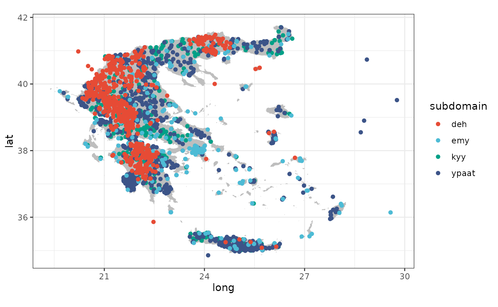
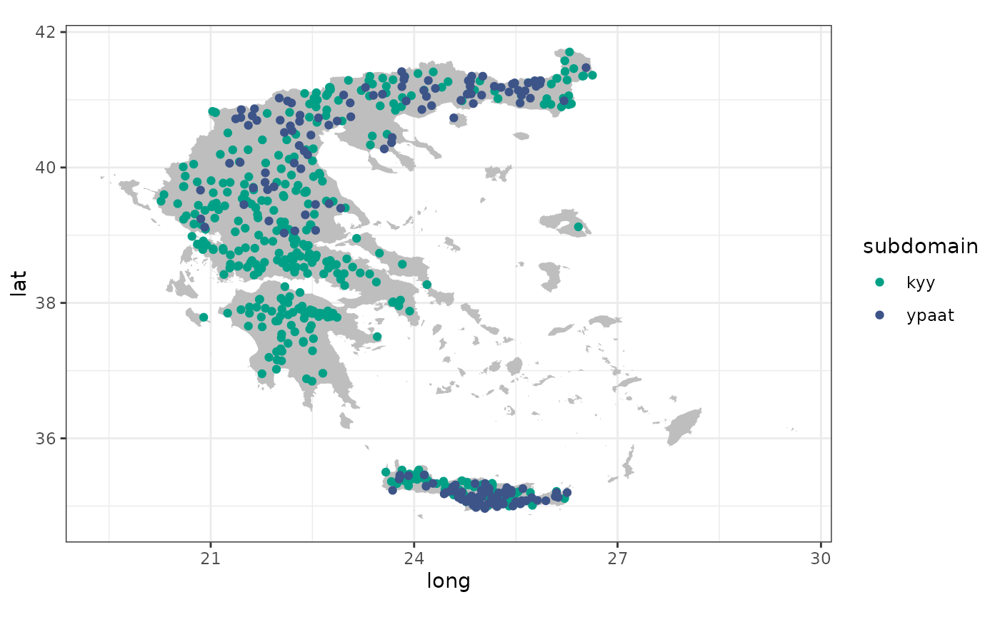

# Using \`hydroscoper\`'s data

This vignette shows how to use the package’s internal data sets.

## Load libraries

``` r

library(hydroscoper)
library(tibble)
library(ggplot2)
```

## Data sets

There are three data sets stored in the package. `stations` is comprised
of the stations’ id, name, longitude, latitude, etc.

``` r

stations
#> # A tibble: 2,322 × 9
#>    station_id name  water_basin water_division owner longitude latitude altitude
#>         <int> <chr> <chr>       <chr>          <chr>     <dbl>    <dbl>    <dbl>
#>  1     501032 AG. … "KOURTALIO… GR13           min_…      NA       NA        NA 
#>  2     200246 GEPH… "ALPHEIOS … GR01           min_…      22.0     37.5     318 
#>  3     200237 TROP… "ALPHEIOS … GR01           min_…      22.0     37.7     728.
#>  4     200231 BYTI… "ALPHEIOS … GR01           min_…      22.2     37.7    1011.
#>  5     200200 LYKO… "ALPHEIOS … GR01           min_…      22.2     37.9     758.
#>  6     200236 MEGA… "ALPHEIOS … GR01           min_…      22.1     37.4     429.
#>  7     200244 ODOG… "REMA CHOR… GR01           min_…      21.8     37.0     182.
#>  8     200204 TRIP… "ALPHEIOS … GR01           min_…      21.9     37.9     570.
#>  9     200198 KAST… "ALPHEIOS … GR01           min_…      22.0     37.9     792.
#> 10     200239 PERD… "ALPHEIOS … GR01           min_…      22.0     37.7     837.
#> # ℹ 2,312 more rows
#> # ℹ 1 more variable: subdomain <chr>
```

`timeseries` of the time series’ id, the corresponding station, variable
type, time step etc.

``` r

timeseries
#> # A tibble: 10,804 × 8
#>    time_id station_id variable      timestep units start_date end_date subdomain
#>      <int>      <int> <chr>         <chr>    <chr> <chr>      <chr>    <chr>    
#>  1    2248     501049 temperature_… NA       °     2009-02-0… 2010-08… kyy      
#>  2     430     200103 wind_directi… NA       °     1950-10-2… 1997-07… kyy      
#>  3     905     200247 wind_directi… NA       °     1967-01-0… 1997-12… kyy      
#>  4    2243     501058 temperature_… NA       °     1999-01-0… 2010-08… kyy      
#>  5     438     200105 wind_directi… NA       °     1950-06-0… 1997-07… kyy      
#>  6     553     200135 wind_directi… NA       °     1964-11-2… 1997-08… kyy      
#>  7     966     200265 wind_directi… NA       °     1967-01-0… 1997-03… kyy      
#>  8     775     200203 wind_directi… NA       °     1964-05-2… 1997-06… kyy      
#>  9    2245     501046 temperature_… NA       °     2007-07-0… 2010-07… kyy      
#> 10     247     200034 wind_directi… NA       °     1969-11-2… 1997-09… kyy      
#> # ℹ 10,794 more rows
```

`greece_borders` is a data-frame for use with the function
`geom_polygon` from the `ggplot2` package.

## Stations location

`stations` and `greece_borders` can be used to create a map with all
Hydroscope’s stations. Unfortunately, there is a number of them that
have erroneous coordinates (over the sea and far from Greece). Also,
there are 120 stations with missing coordinates.

``` r

ggplot() + 
  geom_polygon(data = greece_borders,
               aes(long, lat, group = group),
               fill = "grey",
               color = NA) +
  geom_point(data = stations,
             aes(x = longitude, y = latitude, color = subdomain)) +
  scale_color_manual(values=c("#E64B35FF", "#4DBBD5FF", "#00A087FF", 
                              "#3C5488FF"))+
  coord_fixed(ratio=1) +
  theme_bw()
#> Warning: Removed 120 rows containing missing values or values outside the scale range
#> (`geom_point()`).
```



## Stations with available time series

The location of the stations with time series available to download are
presented at the following map.

``` r

stations_ts <- subset(stations, station_id %in% timeseries$station_id &
                        subdomain %in% c("kyy", "ypaat"))


ggplot() + 
  geom_polygon(data = greece_borders,
               aes(long, lat, group = group),
               fill = "grey",
               color = NA) +
  geom_point(data = stations_ts,
             aes(x = longitude, y = latitude, color = subdomain)) +
  scale_color_manual(values=c("#00A087FF", "#3C5488FF"))+
  coord_fixed(ratio=1) +
  theme_bw()
#> Warning: Removed 10 rows containing missing values or values outside the scale range
#> (`geom_point()`).
```



Although there is a large number of stations with available data, there
is heterogeneity in the coverage of the country.
